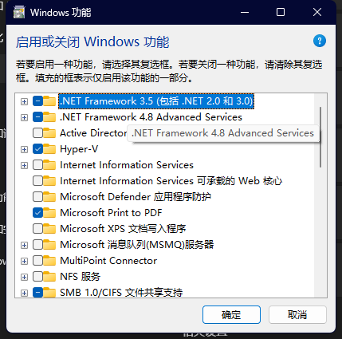

# Docker 安装教程

## Linux 安装 Docker

## 使用官方安装脚本自动安装

```shell
curl -fsSL https://get.docker.com | bash -s docker --mirror Aliyun
```

## 或者使用国内镜像安装

```shell
curl -sSL https://get.daocloud.io/docker | sh
```

### 查看 docker 版本

```shell
docker -v
```

## Win 安装 Docker

### 检测是否开启 hyper-v



### 安装 WSL

然后找到 Windows PowerSheel 并且以管理员运行

安装 `wsl`

```shell
wsl --install
```

安装完成以后需要再安装`Dockers Desktop` 先下载[`Dockers Desktop`](https://desktop.docker.com/win/main/amd64/Docker%20Desktop%20Installer.exe?utm_source=docker&utm_medium=webreferral&utm_campaign=dd-smartbutton&utm_location=module)docker 桌面工具

下载完成以后安装 再就是等待安装重启
完成以后打开`Dockers Desktop` 在控制台中输入
以下命令进行镜像拉取

```shell
docker pull nginx
```

然后执行以下命令查看是否正常执行`docker`容器

```shell
docker run -p 8080:80 -name nginx nginx
```

执行完成在浏览器中访问 `http://localhost:8080` 然后就可以打开 nginx 默认的界面了说明 docker 安装没有问题并且可以正常执行
