# [k3s 部署全过程](https://www.cnblogs.com/hejiale010426/p/16732882.html)

## 安装 k3s 博客

## 准备工作

1.准备俩台可以相互访问的服务器

2.需要先安装 dockers

3.以下教程将使用 VsCode+ssh 插件来进行插件图

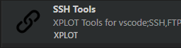

## ssh 连接到俩台服务器

点击打开 ssh 操作界面

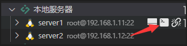

进入需要设置 master 节点的服务器中然后执行 docker 命令启动一个 autok3s 的容器并且需要将 docker 映射进去 注：如果选择使用 docker 做为 k3s 的运行容器必须映射 docker 进去

```c#
 docker run -itd --restart=unless-stopped --name autok3s --net=host -v /var/run/docker.sock:/var/run/docker.sock cnrancher/autok3s:v0.5.2
```

容器启动完成以后访问服务器 ip:8080 然后点击 Core/Clusters

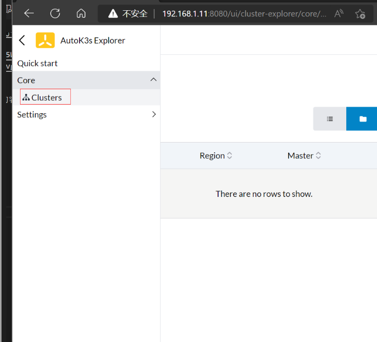

点击 Create 创建一个 Cluster

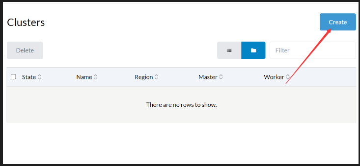

选择 Native

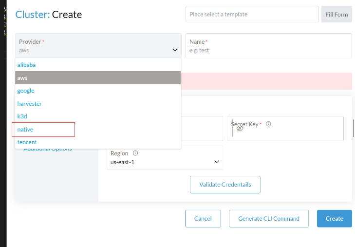

安装的基本参数设置 设置 master 节点 ip 设置 node 节点 ip 俩台服务器密码需要一直

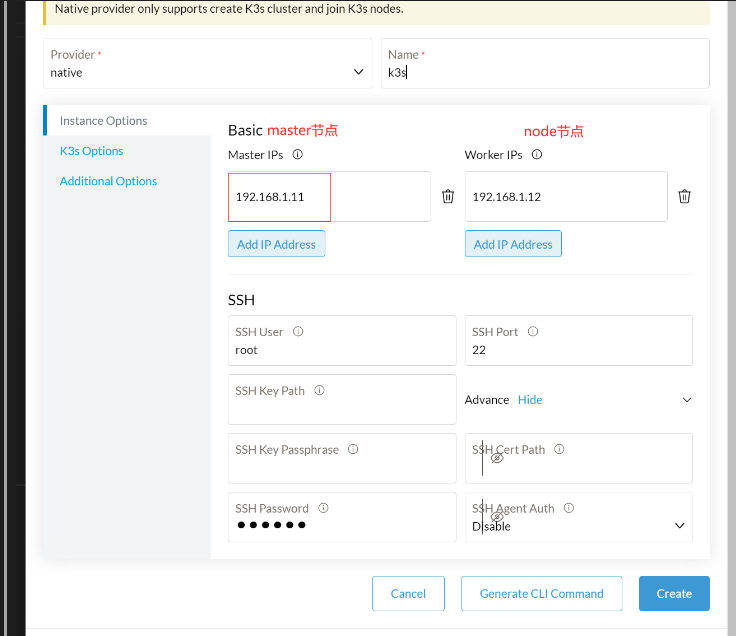

设置 k3s options

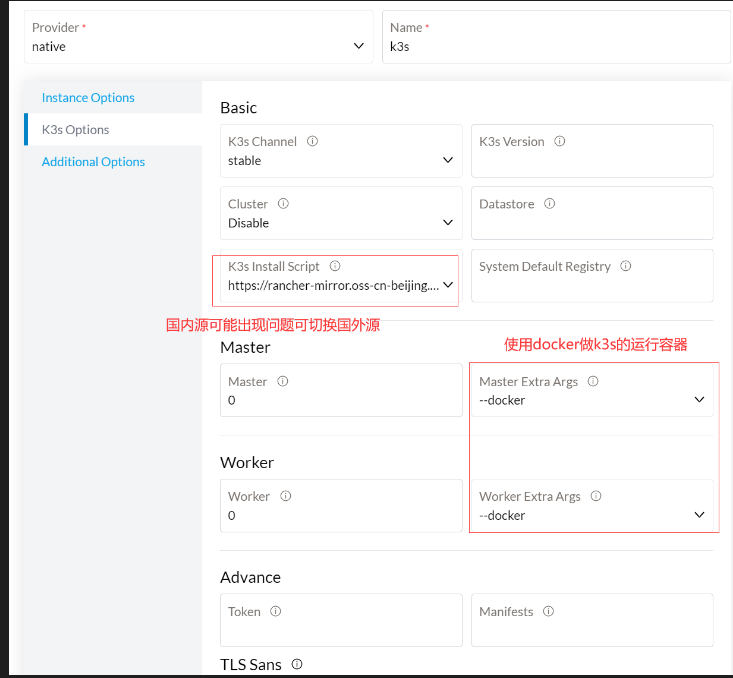

点击右下角的 create

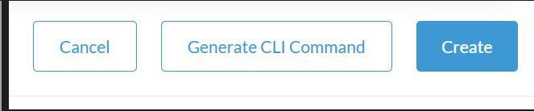

等待 k3s 安装部署完成 需要很长一段时间

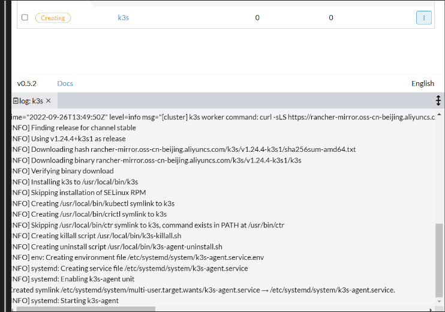

我们可以先安装 k3s 的管理界面 安装我们的 kuboard 管理界面

```shell
sudo docker run -d \
  --restart=unless-stopped \
  --name=kuboard \
  -p 1080:80/tcp \
  -p 10081:10081/tcp \
  -e KUBOARD_ENDPOINT="http://内网IP:1080" \
  -e KUBOARD_AGENT_SERVER_TCP_PORT="10081" \
  -v /root/kuboard-data:/data \
  eipwork/kuboard:v3
```

然后访问 ip:1080 我们可以看到 kuboard 的界面

默认账号：admin

默认密码：Kuboard123

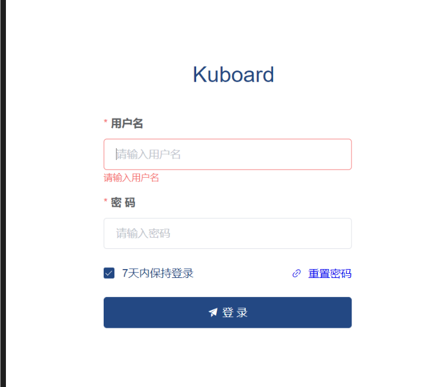

登录成功进入界面 等待 k3s 安装完成 点击 Kubernetes 的添加集群

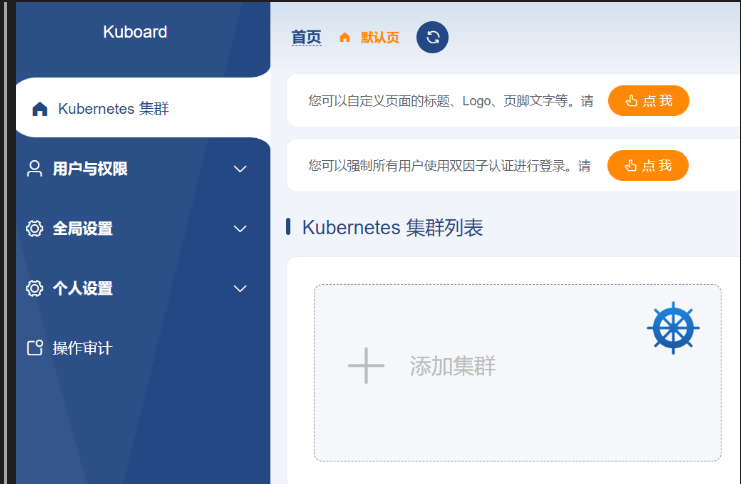

点击 .kubeconfig

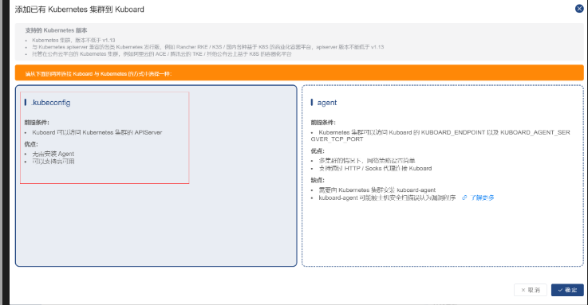

找到 master 节点下的 k3s 配置

路径 /etc/rancher/k3s/k3s.yaml

修改内部的 server ip 为 master 节点的 ip

示例

```
apiVersion: v1``clusters:``- cluster:``  ``certificate-authority-data: LS0tLS1CRUdJTiBDRVJUSUZJQ0FURS0tLS0tCk1JSUJkekNDQVIyZ0F3SUJBZ0lCQURBS0JnZ3Foa2pPUFFRREFqQWpNU0V3SHdZRFZRUUREQmhyTTNNdGMyVnkKZG1WeUxXTmhRREUyTmpReU1ESTBNRGd3SGhjTk1qSXdPVEkyTVRReU5qUTRXaGNOTXpJd09USXpNVFF5TmpRNApXakFqTVNFd0h3WURWUVFEREJock0zTXRjMlZ5ZG1WeUxXTmhRREUyTmpReU1ESTBNRGd3V1RBVEJnY3Foa2pPClBRSUJCZ2dxaGtqT1BRTUJCd05DQUFRdmJOZEdiNDAvWmR4L2JiRjgzZXZObGFsUFVXTm5KMmp6UFZoT0k4VXAKR1QyeXQ1b0FCTEs2a0diWnVEbkowTE9GYnBudXZFMUkyRFl0d2RxMmh3YnFvMEl3UURBT0JnTlZIUThCQWY4RQpCQU1DQXFRd0R3WURWUjBUQVFIL0JBVXdBd0VCL3pBZEJnTlZIUTRFRmdRVXA1YU5GZlU5U0R3dFVoQlZJVTNUCkc4UTgwa293Q2dZSUtvWkl6ajBFQXdJRFNBQXdSUUloQUlxcVhMNFBVa0xsdld3T3hmZ3M2NFNhSHBobFgvaW8KVFJJME9MdnR5VmRXQWlBcFhrcndLRmZBYmFmSDNkZnNjY0dIbGYvdVpMbTJaNG1WeURRZmE4dUtPUT09Ci0tLS0tRU5EIENFUlRJRklDQVRFLS0tLS0K``  ``server: https:``//192.168.1.11:6443`` ``name: ``default``contexts:``- context:``  ``cluster: ``default``  ``user: ``default`` ``name: ``default``current-context: ``default``kind: Config``preferences: {}``users:``- name: ``default`` ``user:``  ``client-certificate-data: LS0tLS1CRUdJTiBDRVJUSUZJQ0FURS0tLS0tCk1JSUJrVENDQVRlZ0F3SUJBZ0lJQ0NjT1VkbCtEZzR3Q2dZSUtvWkl6ajBFQXdJd0l6RWhNQjhHQTFVRUF3d1kKYXpOekxXTnNhV1Z1ZEMxallVQXhOalkwTWpBeU5EQTRNQjRYRFRJeU1Ea3lOakUwTWpZME9Gb1hEVEl6TURreQpOakUwTWpZME9Gb3dNREVYTUJVR0ExVUVDaE1PYzNsemRHVnRPbTFoYzNSbGNuTXhGVEFUQmdOVkJBTVRESE41CmMzUmxiVHBoWkcxcGJqQlpNQk1HQnlxR1NNNDlBZ0VHQ0NxR1NNNDlBd0VIQTBJQUJJQWZuSncrVVVOaUdsN3QKWGhMUFZDTUpyWHIraFUvWVU4SVNoRVNtQktucng0eWZ4NUQ3TnpTdkR5YUdldjk3SVJDUGlKUktvaENFMGlnMwp1Z3I5b1RlalNEQkdNQTRHQTFVZER3RUIvd1FFQXdJRm9EQVRCZ05WSFNVRUREQUtCZ2dyQmdFRkJRY0RBakFmCkJnTlZIU01FR0RBV2dCU1lxTHlEK2tzMjhidVBSMUx2RTZDN1hGV2U5REFLQmdncWhrak9QUVFEQWdOSUFEQkYKQWlBTW5HekViQUx2K2dUZUxFc1M5T1dyOWNrRXhDMUVHT2FBSDBpemdCb2R4UUloQU1xSDFZeUU5N0ZFeXh0Kwp5aHlMaWYxb3A3alcrcHFIakRNT1VTQzg0SGtsCi0tLS0tRU5EIENFUlRJRklDQVRFLS0tLS0KLS0tLS1CRUdJTiBDRVJUSUZJQ0FURS0tLS0tCk1JSUJkakNDQVIyZ0F3SUJBZ0lCQURBS0JnZ3Foa2pPUFFRREFqQWpNU0V3SHdZRFZRUUREQmhyTTNNdFkyeHAKWlc1MExXTmhRREUyTmpReU1ESTBNRGd3SGhjTk1qSXdPVEkyTVRReU5qUTRXaGNOTXpJd09USXpNVFF5TmpRNApXakFqTVNFd0h3WURWUVFEREJock0zTXRZMnhwWlc1MExXTmhRREUyTmpReU1ESTBNRGd3V1RBVEJnY3Foa2pPClBRSUJCZ2dxaGtqT1BRTUJCd05DQUFSQzlKYUppZUVlSHZBVUU5NzA5d3lRUjBQbTgrWlZteis0enpNS1ZZTGYKVDl6and2NUJUUGJoazlFNXh3c3I0Zkg2Zkw5RnI0QWtsZW1HSEhicWJIQ1VvMEl3UURBT0JnTlZIUThCQWY4RQpCQU1DQXFRd0R3WURWUjBUQVFIL0JBVXdBd0VCL3pBZEJnTlZIUTRFRmdRVW1LaThnL3BMTnZHN2owZFM3eE9nCnUxeFZudlF3Q2dZSUtvWkl6ajBFQXdJRFJ3QXdSQUlnZHFhbVpNMUttUzlnT1E2d0k4SWh3UDAvY05XV1ZQeEsKNUF4eU03elRiTElDSUdBOUZWa0hPTDAyN05WaFd4MngydnNtdkNOLzZoa2RGVnhJOFMwM05IUkoKLS0tLS1FTkQgQ0VSVElGSUNBVEUtLS0tLQo=``  ``client-key-data: LS0tLS1CRUdJTiBFQyBQUklWQVRFIEtFWS0tLS0tCk1IY0NBUUVFSUd6VldKY1JpUkljLzFWTnc0UGRKckZFbEk2cisyUkdWWDJMQ0tsZldibnRvQW9HQ0NxR1NNNDkKQXdFSG9VUURRZ0FFZ0IrY25ENVJRMklhWHUxZUVzOVVJd210ZXY2RlQ5aFR3aEtFUktZRXFldkhqSi9Ia1BzMwpOSzhQSm9aNi8zc2hFSStJbEVxaUVJVFNLRGU2Q3YyaE53PT0KLS0tLS1FTkQgRUMgUFJJVkFURSBLRVktLS0tLQo=
```

将其复制到 KubeConfig 里面 填写名称和描述 然后点击确定

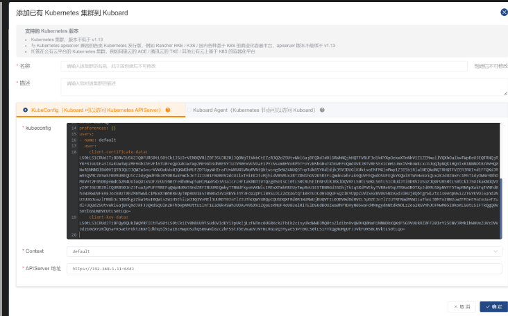

点击确认以后进入这个界面 然后选择 kuboard-admin 再点击集群概要

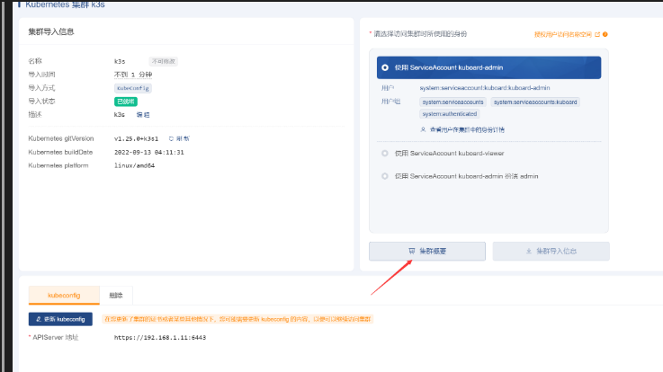

进入到 kuboard 的管理界面就完成了 如果 node 节点的服务器并没有加入到 master 节点请查阅资料或者加群交流 群:737776595

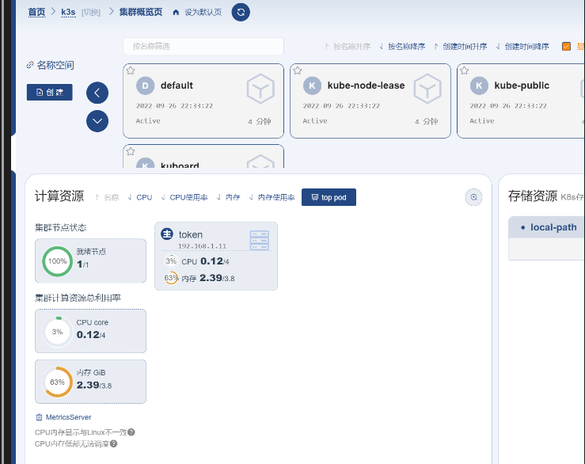
