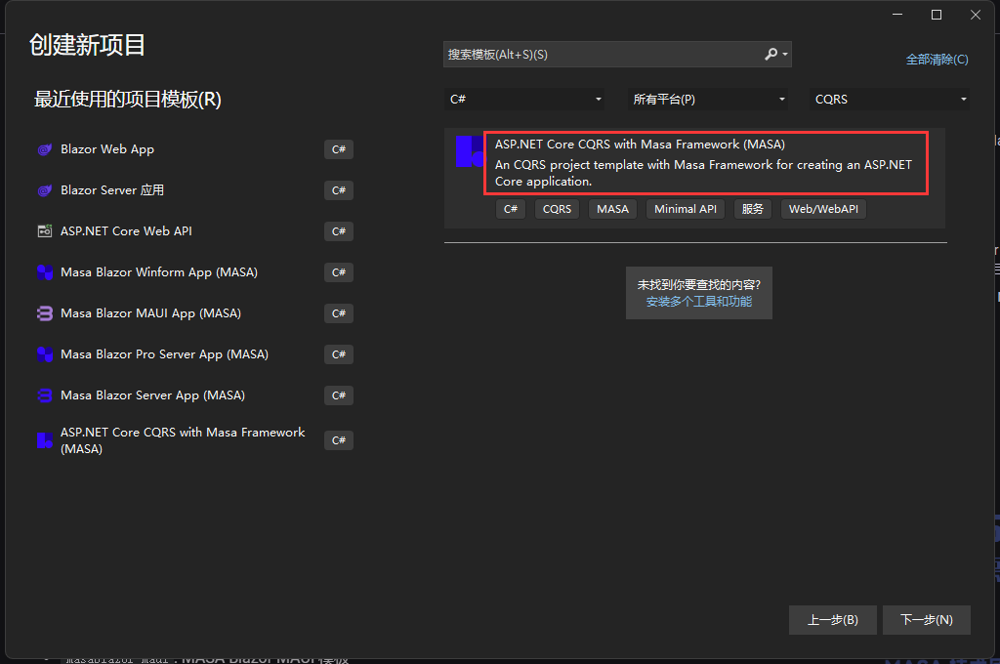
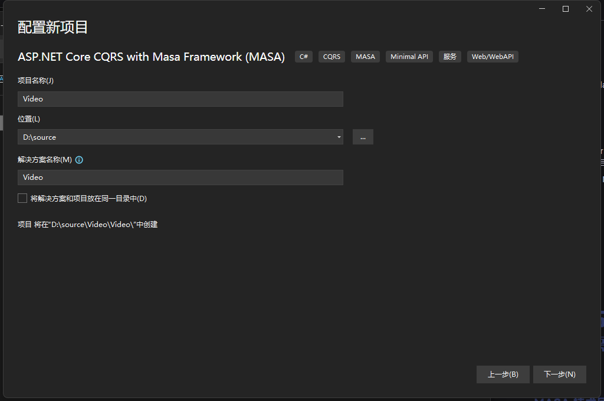
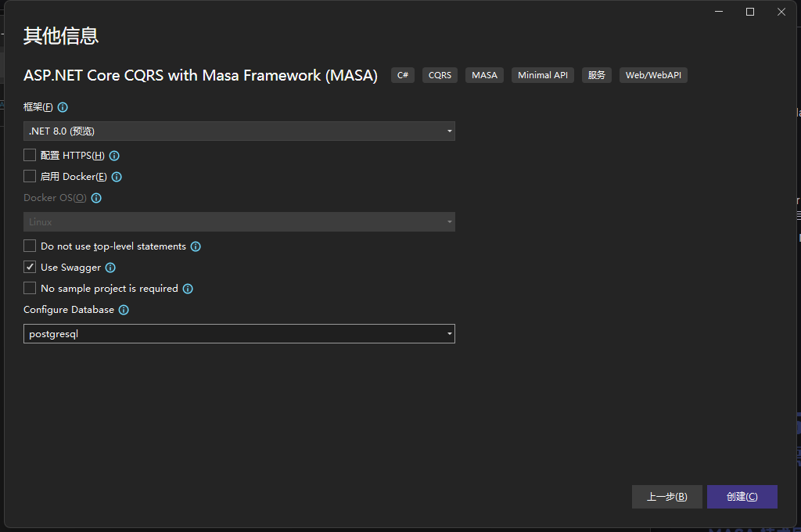
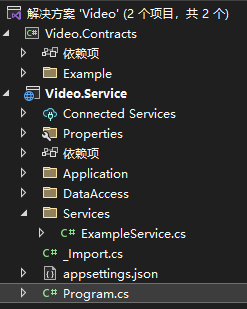

# 后端项目创建

环境准备：`Visual Studio 2022`，`.NET 8 SDK`

1. 第一步安装`MasaFramework`项目模板

   ```cmd
   dotnet new install MASA.Template
   ```

2. 创建后端项目，打开`Visual Studio 2022`，`创建新项目`










项目创建完成，然后得到俩个项目，`Video.Contracts`和`Video.Service`，一般共用的模型或接口定义都放到`Video.Contracts`。

